---
author:
- skilo
layout: post
title: "Notes de cours - Langage d'assemblage x86_64 sous GNU/Linux"
date: 2024-01-04 00:00:00
image: "/assets/img/"
description: "Des petites notes d'assembleur"
main-class: 'dev'
color:
tags:
- asm
- linux
- architecture
categories:
twitter_text: "Des notes de cours sur le langage d'assemblage x86_64 sous GNU/Linux"
introduction: "Des notes de cours sur le langage d'assemblage x86_64 sous GNU/Linux"
---


# Introduction

Dans ce cours j'ai regroupé les différents élément sur l'assembleur que j'ai trouvé sur internet, mes principales ressources sont :
- [Jason Champagne - Assembleur](https://www.youtube.com/watch?v=fvtd2Ut3MHw&list=PLrSOXFDHBtfEs7PCC6r44iXiX5gMlbjcR)
- [Jason Champagne - Architecture](https://www.youtube.com/watch?v=x4yzYMZ5ZNo&list=PLrSOXFDHBtfFrlG51dj8p_zCV994yWahY)
- [Introduction to 64 Bit Intel Assembly Language Programming](https://rayseyfarth.com/asm_1/index.html)

Attention seuls les sections suivantes sont mise a peu près au propre:
- Computer memory
- Memory mapping in 64 bits mode
- Les registres
- Les opérations

Je n'ai pas encore eu le temps de mettre au propre ou juste de compléter
les autres sections.

# Computer memory

In this chapter we will see how a modern computer map the memory in
order to give a protected space for each process and how the Linux
system manage this memory for a process. And we will also view with
`gdb` how that's work.

## Memory mapping

The memory of a computer can be represented as an array of bytes where
each byte has an address (addresses begin at 0). In a modern CPU there
are 'hardware mapping registers' that are used to give each process a
protected address space. This means that there is a difference between
logical and physical memory. Indeed, two different processes can have
access to the same logical '0x4004c8' address, but in reality, this is
not the same physical address.

> [!NOTE]
> In the context of a CPU and memory management, a \"page\" typically
>refers to a fixed-size block of memory used in virtual memory systems.

On a x86_64 CPU there are two different pages size :
- 2 MB, used for the kernel ;
- 4kB, used for most other uses.

The role of the memory system is to translate the upper bits of the
address from a logical to a physical one. Pour traduire une adresse
logique en une adresse physique, nous avons besoin de deux informations :
1. Le numéro de la page ;
2. L'offset au sein de cette page.

Sachant qu'avec des pages de 4kB il y a 4096 octet par pages et que
$2^{12} = 4096$ alors les 12 premiers octet (ceux de droite en
big-endian)

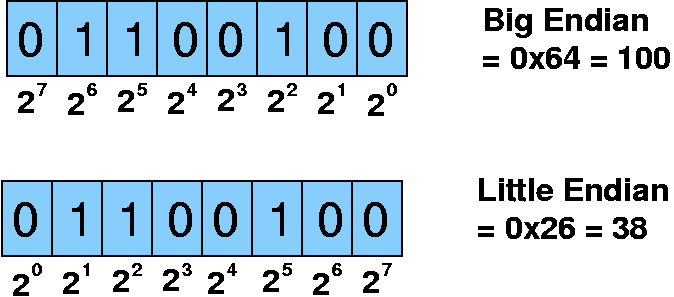{width="70%"}

Tandis que les bits restant (ceux de gauche, toujours en big endian)
sont utilisés pour le numéro de la page. Exemple : avec `Ox4000002220`
les 12 derniers bits sont `0x220` (car 1 caractère hexa représente 4
bits et $3 \times 4 = 12$). Et le reste est `Ox4000002` autrement dit,
l'offset dans la page est de \... et le numéro de la page est de \...
(laissé au lecteur). Ensuite, un registre physique traduit ce numero de
page (les bits restants de gauche) en une adresse physique, par exemple
: `Ox780000000`, on combine donc l'adresse traduite avec l'offset dans
la page et on obtient : `Ox780000220`.\
Il y a plusieurs avantages à ce mode de fonctionnement
1. La protection de la mémoire
2. La standardisation des adresses qu'on a dans notre programme

## Process memory model in Linux

Un processus linux est divisé en 4 régions dans la mémoire :

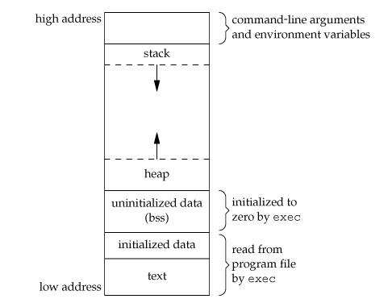{width="70%"}

### La section text

La section text sert a stocker le code executable. (It appears that the
lowest ad dress in an x86-64 process is Ox400000)\
Elle se déclare comme ça :

```asm
.section text
```

### La section data

La section data sert a stocker les données initialisées.\
Elle se déclare comme ça :

```asm
.section data
```

### La section bss (Block Started by Symbol)

La section data sert a stocker les données non-initialisées. Elle
démarre avec tout init à 0\
Elle se déclare comme ça :

```asm
.section bss
```

### La section heap (le tas)

Zone dyamiquement redimensionnable, utilisé lors d'un `malloc` par
exemple.

<center>
<i>Je ne crois pas qu'on puisse l'utiliser directement dans le code source
.asm</i>
</center>

### La section stack (la pile)

Le dernier segment d'un processus est le segment de la stack. Ce segment
est limité en taille par le noyau Linux, typiquement à 16 mégaoctets. Ce
n'est pas une grande quantité d'espace, mais tant que le programmeur
évite de mettre de grands tableaux sur la stack, elle sert très bien à
gérer le contenu du processus, la trace des appels de fonction, des
paramètres, des variables locales et des adresses de retour.

<center>
<i>Je ne crois pas qu'on puisse l'utiliser directement dans le code source
.asm</i>
</center>

## Examining with `gbp`

The format for the p command is either p expression or p/FMT expression
where FMT is a single letter defining the format of data to print. The
format choices are :

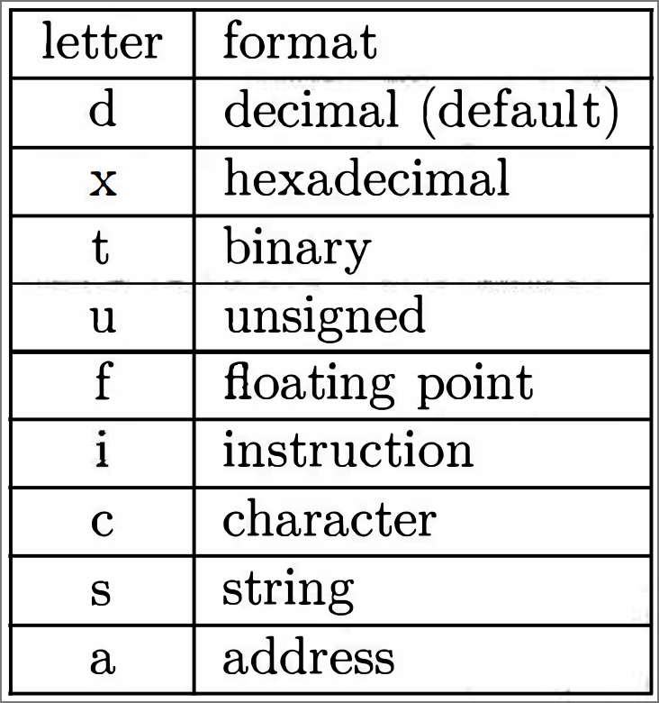{width="40%"}

The format for examine is x/NFS address where N is a number of items to
print (default 1), F is a single letter format as used in the print
command and S is the size of each memory location. Unfortunately gdb
picked some size letters which conflict with some of the size options in
yasm. Here are the size options:

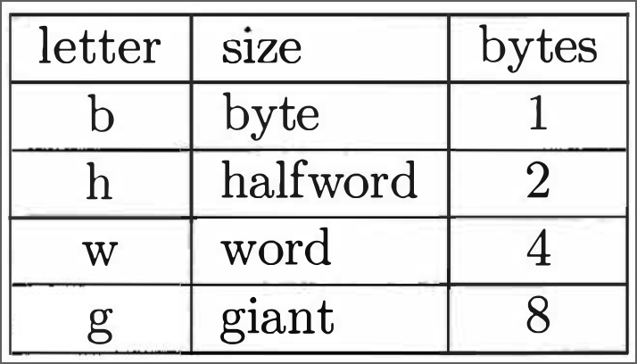{width="40%"}

# Memory mapping in 64 bits mode

Dans cette section, nous allons voir en details comment les adresses
virtuelles sont traduites en adresses physiques dans l'architecture
x86_64. Pour cette traduction, certaines données sont stockées dans le
CPU, d'autres dans la mémoire

## The memory mapping register

On l'appelle le Control Registre 3 ou CR3. Une image simplifié de a quoi
sert ce registre est que c'est un pointeur vers le top d'une collection
hiérarchisée de table dans la mémoire qui définissent la traduction de
ces adresses virtuelles en adresses physiques. Le CPU lui ne retient
qu'une petite quantité de traduction de page, mais regardons comment ça
fonctionne.

Quelque part dans le kernel de l'OS, une hiérarchie initiale des tables
de traductions en préparée et CR3 est rempli avec l'adresse de la table
la plus haute dans cette hiérarchie. On appelle cette table "Page Map
Level 4" ou juste "PML4".

Lorsque le CPU passe à l'utilisation du mappage de la mémoire lors de la
référence mémoire suivante, il commence par utiliser CR3 pour récupérer
l'adresse de PML4.

En gros, au début, CR3 pointe vers le top de PML4. (important pour
comprendre les exemples futurs).

## Vue globale d'une adresse virtuelle

> [!NOTE]
> Sign extension (sometimes abbreviated as sext, particularly in
> mnemonics) is the operation, in computer arithmetic, of increasing the
> number of bits of a binary number while preserving the number's sign
> (positive/negative) and value. This is done by appending digits to the
> most significant side of the number, following a procedure dependent on
> the particular signed number representation used.

Rappelons qu'une page fait 4096 octets et une adresse 8 octets, nous
pouvons donc mettre 512 adresses dans une page. En effet :
$$\frac{2^{12}}{2^3} = 2^9 = 512$$ Sachant que dans une page il y a 4096
octets et que nous voulons nous repérer à un octet prêt dans la page,
nous avons besoin de 12 bits pour exprimer l'offset. De la même manière
si nous voulons nous repérer à une adresse prêt dans une page, nous
avons besoin de 9 bits pour exprimer l'offset. Maintenant que nous avons
compris ça, nous pouvons attaquer la suite sans problème.\
Dans une architecture x86_64, une adresse virtuelle est découpé en 6
champs :

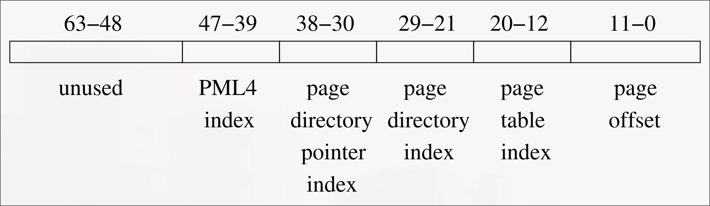{width="\\textwidth"}

Les bits 63-47 (et oui, pas 48) :
    Les 16 bits les plus à gauches sont ignorés, ils sont sensés servir à
    une "sext" des bits 47-39 mais ils ne font pas partit du processus de
    traduction de l'adresse. Ils sont donc tous à 0 et en réalité même le
    bit 47 est à 0 aussi, donc les bits 47-63 sont à 0.

-   Les quatre champs suivant (index)

Les quatre champs suivants sont des index de différentes page de
mémoire, comme on l'a vu précédemment, ils font dont 9 bits de long.

-   Le dernier champ (offset)

Le dernier champ sert d'offset à l'intérieur d'une page a un octet près,
comme vu précédemment il fait donc 12 bits de long.

## Exemple complet de traduction d'adresse logique en adresse physique

<https://stacklima.com/pagination-a-plusieurs-niveaux-dans-le-systeme-d-exploitation/>

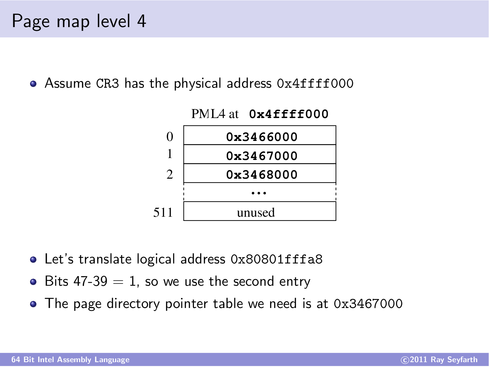{width="\\textwidth"}

```py
    >>> eval("0b" + bin(0x80801fffa8)[2:][::-1][30:38][::-1])
```

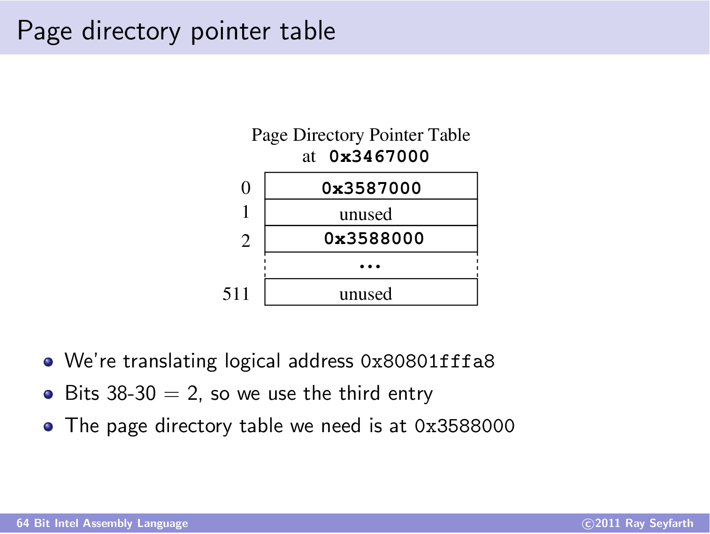{width="\\textwidth"}

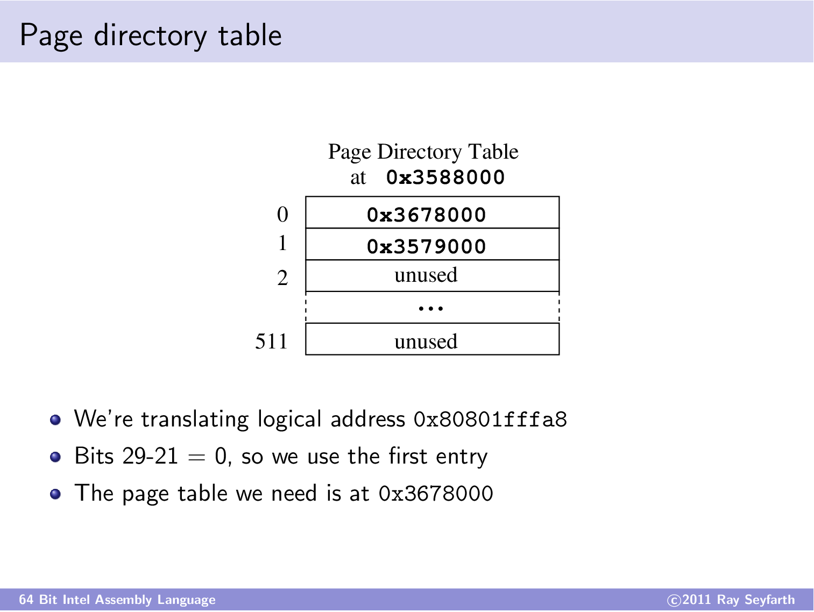{width="\\textwidth"}

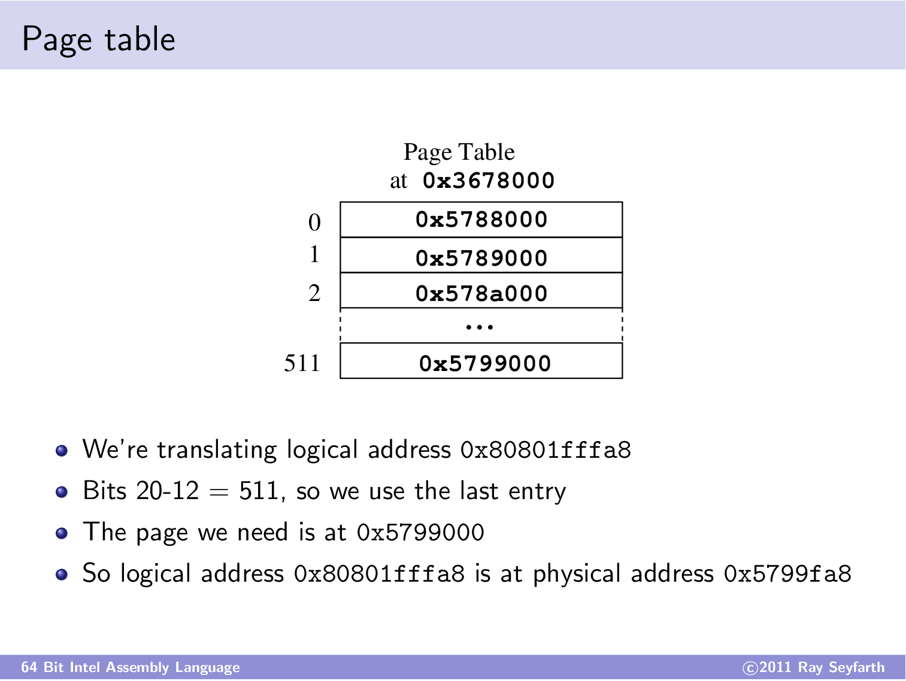{width="\\textwidth"}

## Support de large page

The normal size page is 4096 bytes. The CPU designers have added support
for large pages using three levels of the existing translation tables.
By using 3 levels of tables, there are 9 + 12 = 21 bits left for the
within page offset field. This makes large pages $2^{21} = 2097152$
bytes.

## Fast lookup

Dès qu'on resolve un adresse elle est mise en cache dans une sorte de
"hash table".

# Les registres

## Définition

> [!NOTE]
> Un registre est un emplacement de mémoire interne à un processeur. Ce
> dernier est de taille très réduite et de rapidité maximale.

## Registre a usage général

En x86_64, il y a plusieurs registres, voici une illustration des
principaux :

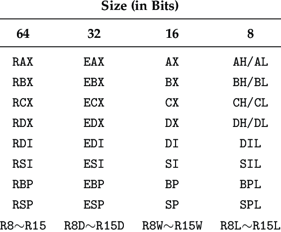{width="50%"}

On voit bien que chaque registres de 64 bits peut être décliné en
registres de 32, 16 ou 8 bits en spécifiant a quelle déclinaison du
registre on veut accéder, il en est de même pour les registre r8 -\> r15
et il faut ajouter "b" "w" "d" pour y accéder comme "byte" "word" ou
"double". De plus, il existe aussi des registres de 128 bits servant à
stocker des entiers flottants :

  | **Registre** | **Description** |           **Usage**         |
  |:------------:|:---------------:|:---------------------------:|
  |     XMM0     |   Registre xmm0 |   Stockage d'entiers flottants|
  |     XMM1     |   Registre xmm1 |   Stockage d'entiers flottants|
  |     XMM2     |   Registre xmm2 |   Stockage d'entiers flottants|
  |     XMM3     |   Registre xmm3 |   Stockage d'entiers flottants|
  |     \...     |       \...      |   Stockage d'entiers flottants|
  |    XMM15     |  Registre xmm15 |   Stockage d'entiers flottants|

Il y a donc 16 registres à usage général, il suffit donc de 4 bits pour
les adresser, ce qui rends les instructions utilisant des registres bien
plus simple que celle utilisant des adresses mémoire.\

## Déplacement de valeurs dans un registre

En utilisant l'instruction `mov` :
-   Déplacer dans `rax` une valeur clear rax avec la valeur ;
-   Déplacer dans `eax` une valeur clear rax avec la valeur ;
-   Déplacer dans `ax` une valeur ne clear pas rax mais affecte que les
    16 bits ;
-   Déplacer dans `al` une valeur ne clear pas rax mais affecte que les
    8 bits ;

Ces comportements peuvent ne pas être voulues, on peut alternativement
utiliser d'autres instructions tel que :
-   `movsx rax, byte [data]` : Déplace un `byte` dans `rax` en faisant
    une extension de signe ;
-   `movzx rbx, word [sum]` : Déplace un `word` dans `rbx` en fillant à
    gauche avec des 0 (sans toucher au bit de signe) ;
-   `movsxd rcx, dword [count]` : Déplace un `dword` dans `rcx` en
    faisant une extension de signe.

## Le RFLAGS register (plus communement EFLAGS register) {#sec:flags}

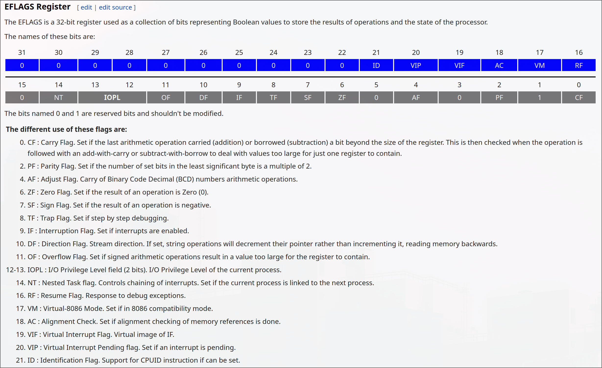{width="\\textwidth"}

# Les variables

$\bullet$ Comme dit dans la section \"Section\", on doit :
-   Déclarer les variables initialisées dans \"data\"
-   Déclarer les variables non-initialisées dans \"bss\"\

$\bullet$ Une déclaration de variable se fait sous la forme :

    nom_variable: <prefix>|<suffix> <donnee>

$\bullet$ En fonction de l'emplacement de la variable, il faut utiliser
le préfixe :
-   data : \"d\"
-   bss : \"res\"\

$\bullet$ En fonction de la taille de la variable que l'on veut
déclarer, il faut utiliser le suffixe :
-   \"b\" : byte, 8 bits
-   \"w\" : word, 16 bits
-   \"d\" : double word, 32 bits ($\cong$ float)
-   \"q\" : quadruple word, 64 bits ($\cong$ double)\

$\bullet$ On peut écrire des nombres sous différentes bases :
-   Décimal : $d$ ou $t$ $5$ ou $5d$ ou $0d5$ ou $5t$\...
-   Octal : $q$ ou $o$ $5o$ ou $5q$ ou $0o5$
-   Binaire : $b$ ou $y$ $0b111101101$ ou $01101011011b$
-   Hexadécimal : $x$ ou $h$ $0x1F4$ ou $0e3h$\

**Exemple**\
Pour mettre 4 dans $rax$ en passant par une variable, on fait :

```asm
.section data
    ma_variable: db 4d

.section text
    global _start

_start:
    mov rax, [ma_variable]
```

# Les opérations

Lors de la programmation en langage d'assemblage, différentes opérations
peuvent être effectuées sur les registres. Nous allons tout d'abord voir
les opérations mathématiques.

## Les opérations mathématiques

### La négation

L'instruction `neg` effectue le complément à deux (c'est à dire inverse
le signe) de son opérande qui peut être à la fois un registre ou valeur
en mémoire. Notons qu'il est possible de spécifier la taille de cette
opérande, voici un tableau rappelant les tailles possibles.

<figure>
<div class="center">
<table>
<thead>
<tr class="header">
<th style="text-align: left;"><strong>Unité</strong></th>
<th style="text-align: center;"><strong>Taille en bits</strong></th>
</tr>
</thead>
<tbody>
<tr class="odd">
<td style="text-align: left;">Byte</td>
<td style="text-align: center;">8 bits</td>
</tr>
<tr class="even">
<td style="text-align: left;">Word</td>
<td style="text-align: center;">16 bits</td>
</tr>
<tr class="odd">
<td style="text-align: left;">Dword (Double Word)</td>
<td style="text-align: center;">32 bits</td>
</tr>
<tr class="even">
<td style="text-align: left;">Qword (Quad Word)</td>
<td style="text-align: center;">64 bits</td>
</tr>
</tbody>
</table>
</div>
</figure>

Il est important de retenir que cette instruction modifie les valeurs
des flags `ZF` et `SF` (voir [3.4](#sec:flags){reference-type="ref"
reference="sec:flags"}), il sera possible de faire des conditions sur
ces valeurs de flag.\
Quelques exemple d'utilisation de `neg`

```asm
neg rax         ; Negationne `rax'
neg dword [x]   ; Negationne 4 octets à `x'
neg byte [x]    ; Negationne 1 octet à `x'
```

### L'addition

L'addition prends deux opérandes, le premier corresponds à la
destination. Ces deux opérandes peuvent être :
-   Une constante ;
-   Une référence mémoire ;
-   Un registre

Mais attention, il peut n'y avoir qu'une seul référence mémoire et
évidemment la destination ne doit pas être une constante. De plus, les
flags mise à jour, sont : `CF`, `OF` et `ZF` (voir
[3.4](#sec:flags){reference-type="ref" reference="sec:flags"}). Il peut
aussi être pratique de connaitre l'instruction `inc`
($\Leftrightarrow \texttt{++i}$).\
Quelques exemple d'utilisation d'`add` et d'`inc`

```asm
add rax, 1      ; Ajoute 1 à rax
inc rax         ; Idem
add [rax], 1    ; Ajoute 1 à la valeur pointée par rax
```

<center>
<i>Pour parcourir octet par octet une chaine de caractère par exemple, il
ne faut pas ajouter 8 à l'adresse mais 1 car ça comprends qu'on veut
aller d'octet en octet</i>
</center>

### La soustraction

L'instruction `sub` est exactement la même chose que `add` sur `tout`
les points, sauf :
- Évidemment, elle effectue une soustraction ;
- `dec` $\Leftrightarrow$ `--i`.

### La multiplication

Maintenant qu'on arrive aux multiplications/divisions on aura à chaque
fois deux instructions distinctes : une pour les entiers signés et une
autre pour les non signés (précédée d'un "i"). Nous allons uniquement
voir la version pour les entiers non signés car c'est pareil pour celle
des entiers signés. Il s'agit donc de l'instruction `imul`,
contrairement aux add/sub cette instruction peut se décliner en trois
versions

#### Version à une opérande

La version à une opérande prends une source en paramètre en renvoie le
résultat de la multiplication dans `rdx:rax`, la source peut être un
registre ou une référence mémoire, la raison pour laquelle ça renvoie le
res dans deux registres est qu'une multiplication de deux nombres de 64
bits peut donner 128 bits (et oui : $2^{64} \times 2^{64} = 2^{128}$).
Les bits de poids forts sont dans `rdx` et ceux de poids faibles dans
`rax`.

Quelques exemples

```asm
imul qword [data]  ; * rax par data
mov [high], rdx    ; Sauvegarde le res
mov [low], rax     ; Sauvegarde le res
```

#### Version à deux/trois opérandes

Dans la version à deux ou trois opérandes c'est la même chose mais :\
Pour la version à deux opérandes, la destination est le premier
opérande\
Pour la version à trois opérandes, ça fait : `imul a, b, c`
$\Leftrightarrow a = b \times c$\
Les flags mis à jour par une multiplication sont : OF, CF, SF, ZF et PF
(voir [3.4](#sec:flags){reference-type="ref" reference="sec:flags"})

#### Exercice : 

Vérifier si un triplet $(a, b, c) \in \mathbb{Z}^3$ est un triplet
pythagoricien, sachant que les comparaisons n'ont pas encore été vues,
interpréter la valeur d'un flag du registre EFLAG comme la réponse.

### La division

La division se distingue des opérations précédentes car elle n'est pas
simplement une application de $\mathbb{R^2}$ dans $\mathbb{R}$ elle est
plutôt une application de $\mathbb{R^2}$ dans $\mathbb{R^2}$.
L'instruction `idiv` se comporte en quelque sorte en sens inverse de la
multiplication, avec `rdx:rax` qui représente maintenant le dividende.
De plus, il existe une seule version de cette instruction, avec un
opérande où ce dernier joue le rôle du diviseur. Le quotient est stocké
dans `rax` et le reste dans `rdx`. En ce qui concerne les drapeaux
affectés par une division, les drapeaux CF, ZF et SF peuvent être
affectés.

Maintenant que nous avons vu comment faire des opérations mathématiques,
nous allons voir comment faire des opérations sur les bits (bitwise
operations).

## Les opérations bit à bit

En plus de ces opérations, il existe également des opérations binaire
qui manipulent les bits des valeurs dans les registres :
-   **and :** `and rax, rbx` Effectue un ET logique bit à bit entre les
    valeurs dans les registres `rax` et `rbx`.
-   **or :** `or rax, rbx` Effectue un OU logique bit à bit entre les
    valeurs dans les registres `rax` et `rbx`.
-   **xor :** `xor rax, rbx` Effectue un OU exclusif (XOR) bit à bit
    entre les valeurs dans les registres `rax` et `rbx`.
-   **not :** `not rax` Effectue une négation bit à bit de la valeur
    dans le registre `rax`.\

# Les conditions

Dans le langage d'assemblage, les conditions sont souvent utilisées pour
contrôler le flux d'exécution d'un programme. Voici quelques
instructions conditionnelles courantes :
-   `cmp <v1> <v2>` : Comparaison de valeurs numériques.
-   `jmp <label>` : Saut inconditionnel à l'étiquette spécifiée.
-   `je` : Saut si $a == b$ (égal).
-   `jne` : Saut si $a \neq b$ (différent).
-   `jg` : Saut si $a > b$ (plus grand).
-   `jl` : Saut si $a < b$ (plus petit).
-   `jge` : Saut si $a \geq b$ (plus grand ou égal).
-   `jle` : Saut si $a \leq b$ (plus petit ou égal).

Ces instructions conditionnelles sont utilisées pour prendre des
décisions basées sur les résultats des comparaisons entre valeurs.\
(le retour de cmp est envoyé dans un flag)\
Voici d'autre comparaison qui font un mv après :


  | **Instruction** |  **Effect** |
  |:---------------:|:------------------------------------:|
  |cmovz             |Move if zero flag set|
  |cmovnz            |Move if zero flag not set (not zero)|
  |cmovl             |Move if result was negative|
  |cmovle            |Move if result was negative or zero|
  |cmovg             |Move if result was positive|
  |cmovge            |Move if result was positive or zero|

# La Stack

## Explication globale de la Stack

La stack se mets en place sur les adresses hautes de la mémoire, souvent
de la forme : `Ox7fffXXXXXOOO`, les `X` sont pas forcément mis à `f`,
c'est causé par la \"randomisation de la stack\".\
On peut ajouter `push` des objets à la Stack ou en retirer `pop`.

## Le pointeur `rsp`

Le pointeur `rsp` est un pointeur qui pointe toujours sur le haut de la
pile.\
\
$\bullet$ `push` dans la stack revient à :

```asm
bits 64

section .data
    a: dq 5

section .text
    global _start

_start:
    mov rax, [a]
    sub rsp, 8
    mov [rsp], rax
```

Car la stack est toujours définit au top de la mémoire, pour rajouter un
truc on descends donc vers les adresses basses.\
\
$\bullet$ `pop` dans rax revient à :

```asm
bits 64

section .data
    a: dq 5

section .text
    global _start

_start:
    mov rax, [rsp]
    add rsp, 8
```

## Le pointeur `rbp`

Le pointeur `rbp` sert à établir un stack frame et par exemple à accéder
aux variables locale d'une fonction

## Stack Frame

### Création d'un stack frame

Un stack frame c'est un espace qu'on créer dans la stack pour y stocker
des trucs. Ça sert, par exemple, a ne pas altérer les registres lors de
l'appel d'une fonction\
Pour le créer un stack frame de t octets, tu fais :

```asm
push rbp
mov rbp, rsp
sub rsp, <t>
```

où `t` corresponds a la taille du stack frame, (assert $t \mid 16$)

### Suppression d'un stack frame

Pour supprimer le stack frame on peut utiliser l'instruction `leave`.\
Et l'instruction `leave` est équivalente à :

```asm
; Destruction du stack frame
    mov rsp, rbp
    pop rbp
```

### Ajout de donnée dans le stack frame

Pour ajouter une donnée au stack frame, on fait :

```asm
bits 64

section .data
    a: dq 5
    b: dq 6

section .text
    global _start

_start:
    ; Premiere instruction de maarde
    mov rax, [a]
    push rax

    ; Création d'un stack frame
    push rbp
    mov rbp, rsp
    sub rsp, 32

    ; Ajout de b au stack frame
    mov rax, [b]
    mov [rsp], rax

    ; Ajout de b au stack frame
    mov rax, [b]
    mov [rsp+8], rax
```

Attention, car si on mets trop de truc dans le stack frame ça va
déborder sur la stack

# Les conventions d'appels

<center>
(ça ne parlera que des CA pour <a href="https://www.uclibc.org/docs/psABI-x86_64.pdf">Linux
64bits</a>)
</center>


  |           **/**           | **Description** |
  |:-------------------------:|:-----------------------------------------------:|
  |         Paramètres        |  'RDI', 'RSI', 'RDX', 'RCX', 'R8', 'R9' (entiers)|
  |                           |  'XMM0' à 'XMM7' (flottants)|
  | Paramètres supplémentaires|  pile (*de droite à gauche*)|
  |      Valeur de retour     |  'RAX' (entier : 64 bits)|
  |                           |  'RAX' + 'RBX' (entier : 128 bits)|
  |                           |  'XMM0', 'XMM1' (flottants)|
  |    Registres conservés    |  'RBX', 'RBP', 'RSP', 'R12' à 'R15'|
  |    Registres volatiles    |  'RAX', 'RDI', 'RSI', 'RCX', 'RDX', 'R8' à 'R11'|
  |                           |  'XMM0' à 'XMM15'|


# Les fonctions

## Écriture d'une fonction

Une fonction c'est juste un label, par exemple :
```asm
say_hello_world:
    mov rax, 1
    mov rdi, 1
    mov rsi, hello_msg
    mov rdx, HELLO_LEN
    syscall
```

Pour savoir où mettre chaque paramètre, faut aller voir les conventions
d'appels.

## L'instruction `call`

Il faut bien l'appeler au bout d'un moment, pour ça il faut jump sur
l'étiquette de la fonction puis a la fin jump sur l'instruction qui
aurait dû suive l'appel de la fonction.\
La manière de faire est la suivante :

```asm
```

TODO :\

-   Écriture d'une fonction ; lien vers convention d'appel
-   $\cong$ `call`
-   $\cong$ `ret`
-   $\cong$ `leave`
-   Ecrire des variables locales dans un stack frame
-   Appeler depuis un code C une fonction asm

# Astuces en vrac

-   La commande `strace` permet de voir les syscall ;
-   Rappel ; Pour effectuer un appel système sur un [Linux 64
    bits](http://www.x86-64.org/documentation/abi.pdf), il faut avoir le
    schéma suivant :
    -   Le registre rax doit contenir le numéro d'appel système ;
    -   Le registre rdi doit contenir le premier argument ;
    -   Le registre rsi doit contenir le deuxième/second argument ;
    -   Le registre rdx doit contenir le troisième argument ;
    -   Le registre r10 doit contenir le quatrième argument ;
    -   Le registre r8 doit contenir le cinquième argument ;
    -   Le registre r9 doit contenir le sixième argument.
-   Pour rendre le code exécutable, il faut faire les commandes suivante :  
    1.  Assemblage en langage machine :
        `nasm -f elf64 source.asm sortie.o`
    2.  Éditeur de lien : `ld sortie.o -o prog`
-   Lorsque dans le code il y a des `[@0x...]` c'est l'action de
    déréférencement, on remplace l'adresse dans les crochets par la
    valeur pointée par cette même adresse.\
    On peut mettre devant le type de la donnée `qword, dword, ...` ;
-   `global` sert a exporter une étiquette afin de la rendre visible,
    pour l'éditeur de lien par exemple ;
-   `%define truc 5` fait exactement la même chose que `#define` en C ;
-   On peut avoir la taille d'un truc avec : `$-truc`, faire une
    constante avec : `true: equ 1` ;
-   On peut utiliser des `db` pour faire des `int` mais faut les mettre
    dans un registre qui corresponds en terme de taille.\
    Par exemple, `a: db 1` doit aller dans `al` et pas `rax`.

# Lexique
